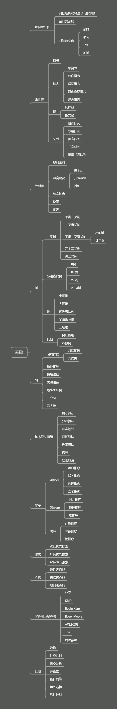

之前买了王争老师的课程看了一点，也没实操，也没做笔记，感觉学不下去，所以这次又重新捡起来，2021年立个flag，要把王争老师的数据结果和设计模式看完，并且都做完笔记，以便以后复习。今天这一篇就是第一篇，加油。

#  0.1  数据结构与算法？

竟然是说数据结构和算法，那我们就先说什么是数据结构？什么是算法？

##  0.1.1  广义上介绍

数据结构就是指一组数据的存储结构，算法就是操作数据的一组方法。

##  0.1.2  狭义下介绍

是指某些著名的数据结构和算法，比如队列、栈、堆、二分查找、动态规划等。

##  0.1.3  数据结构和算法的关系

数据结构和算法是相辅相成的，数据结构是为了算法服务的，算法要作用在特定的数据结构之上。所以，我们需要数据结构和算法一起学习。

比如：数组具有随机访问的特点，常用二分查找算法需要用数组来存储数据，但是如果我们选择链表这种数据结构，二分查找算法就无法工作了，因为链表并不支持随机访问。

##  0.1.4  学习导图

把这个导图填满时，就是学完时，各位加油。
